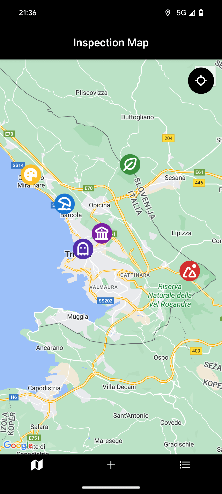

# 📍 Inspection App

Inspection App is a **React Native** application designed for users to create, manage, and visualize **inspections** on an interactive map. It allows users to **add locations with markers**, store images, and track their inspections efficiently.

## 🚀 Features

- **Interactive Map**: Display inspections with custom markers.
- **Add Inspections**: Select a location, take/upload an image, and save inspection details.
- **Draggable Marker**: Choose an inspection location by dragging a marker.
- **Inspection List**: View and manage all saved inspections.
- **Customizable Markers**: Choose marker colors and icons for better categorization.
- **Offline Storage**: Saves inspections locally using **AsyncStorage**.
- **GPS Integration**: Centers the map on the user’s current location.
- **Smooth Navigation**: Uses **Expo Router** for seamless transitions between screens.

## 🛠️ Tech Stack

- **React Native**
- **Expo Router**
- **React Navigation**
- **react-native-maps** (Google Maps integration)
- **AsyncStorage** (Local storage)
- **Expo Location** (GPS integration)

## 📂 Project Structure

```
/app                     # Main application folder
│── /(tabs)              # Tab navigation container
│   │── /add             # Stack for adding inspections
│   │   │── _layout.tsx  # Stack layout for add screens
│   │   │── index.tsx    # Map screen for selecting location
│   │   │── image.tsx    # Screen for adding an image
│   │   │── info.tsx     # Screen for entering inspection details
│   │── _layout.tsx      # Layout for the tabs navigation
│   │── index.tsx        # Map screen with inspection markers
│   │── list.tsx         # Inspection list screen
│── _layout.tsx          # Root layout of the app
│── +not-found.tsx       # 404-like screen for unknown routes
```

## 📦 Installation

### 1️⃣ Prerequisites

- Install [Node.js](https://nodejs.org/) and [Expo CLI](https://docs.expo.dev/)
- Install an Android Emulator or use a physical device with **Expo Go**.

### 2️⃣ Clone the Repository

```sh
git clone https://github.com/robytecoder/inspection-app.git
cd inspection-app
```

### 3️⃣ Install Dependencies

```sh
npm install
```

### 4️⃣ Run the App

Start the development server:

```sh
npm run start
```

Then scan the QR code with **Expo Go** on your mobile device.

## 📍 How to Use

### **1️⃣ Adding an Inspection**

1. Open the **Add** tab.
2. Select a location by dragging the marker.
3. Take or upload an image.
4. Enter a title, description, and select a marker color/icon.
5. Save the inspection.

### **2️⃣ Viewing Inspections**

- Go to the **List** tab to view all saved inspections.
- Click on an inspection to center the map on its location.

### **3️⃣ Navigating the Map**

- Click on an inspection marker to open a modal with details.
- Use the **Locate** button to center the map on your current location.

## ⚠️ Known Issues & Limitations

- **React Native Maps New Architecture Issues**: Some issues with marker rendering on **New Expo Architecture**.
- **First Click on Inspection (List Tab) Doesn't Center the Map**: After saving a new inspection, the first attempt to center on an inspection from the list does not work correctly.
- **Icon Flickering**: There are occasional rendering issues with icons that cause flickering.

## 🎯 Future Improvements

- **Cloud Sync**: Save inspections to Firebase or a backend.
- **Export Data**: Allow users to export inspection reports.
- **Multi-User Collaboration**: Share inspections with team members.
- **CSS Management (Dark/Light Themes)**: Implement theme switching for better user experience.
- **Icon Clustering**: Improve map performance by clustering nearby inspections.
- **Allow Inspection Modifications**: Enable users to edit existing inspections.
- **Map Provider Context for Global State**: Improve map state management across screens.
- **Cross-Device Testing & Responsiveness**: Ensure smooth performance and UI consistency across different screen sizes and devices.
- **iOS Support**: Expand the app to work on iOS devices with full feature parity.

## 📝 License

This project is licensed under the **MIT License**.

---

### 📸 Screenshots




---

### 📇 Author

Developed by **Limina**  
GitHub: [robytecoder](https://github.com/robytecoder)
